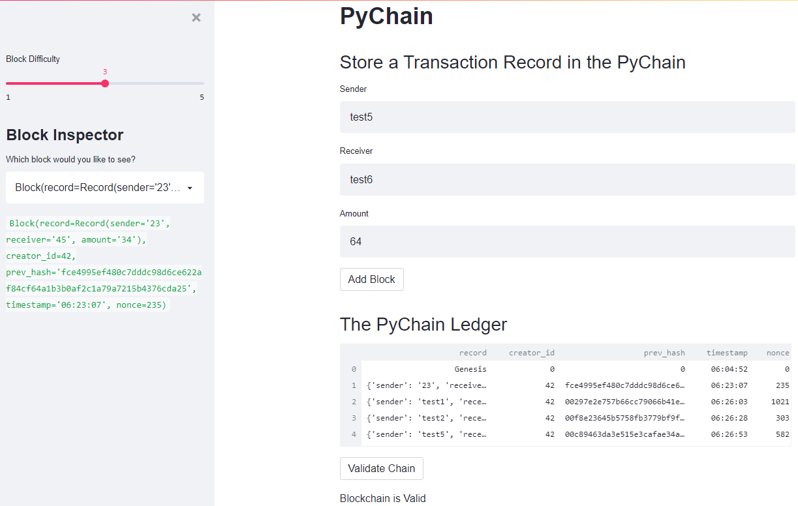

# Berkeley Fintech Module 18 Challenge
Create and validate a blockchain using Streamlit

Multiple blocks of the block chain:


Determine the blockchain validity in the streamlit web screen:


Streamlit usage and blockchain validity determination:


---

## Technologies

This project uses python 3.7 along with the following packages:

* [Streamlit](https://streamlit.io/) - Streamlit turns data scripts into shareable web apps.

* [pandas](https://github.com/pandas-dev/pandas) - Data analysis and manipulation library.

---

## Installation Guide

Please install the following before starting the application

```python
  pip install streamlit
  pip install pandas

```
In case of issues, please see the requirements.txt for a complete list of packages with versions needed to run this application

---

## Usage

Please download the project or clone the project using git clone

Please execute the following on the command line in the project directory:

```python
streamlit run pychain.py
```
strealmlit should open automatically in a browser. 
If it does not, please follow the instructions on the command line.

---

## Contributors

Sangram Singh (sangramsinghg@yahoo.com)

---

## License

MIT